FEC Survey Responses
================
Peter Rabinovitch
2026-07-09

# Responses

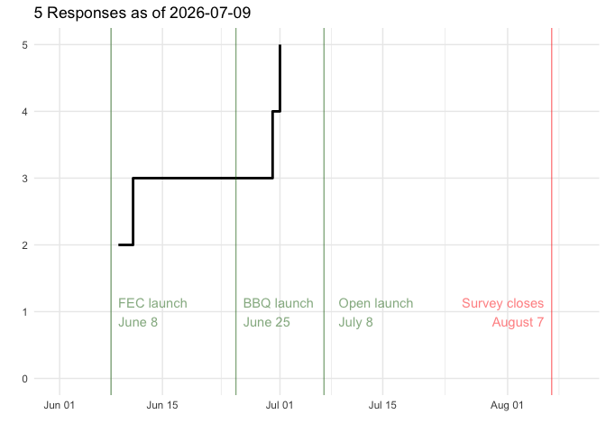<!-- -->

# Survey Responses

## 🔵 About Your Family

### 🔵 Question 1

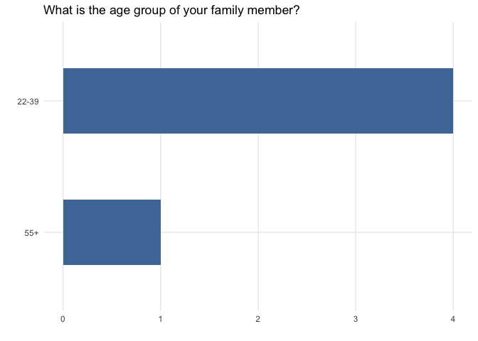<!-- -->

### 🔵 Question 2

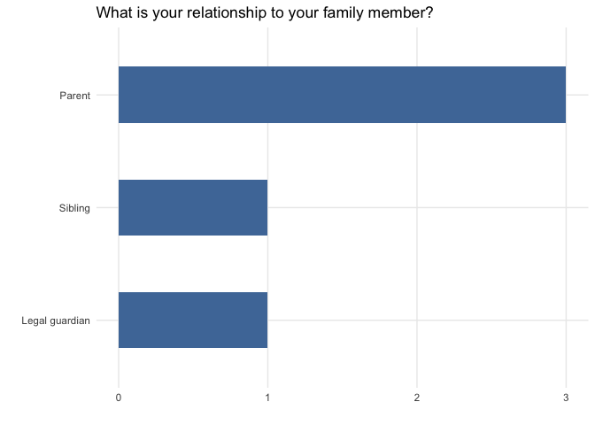<!-- -->

### 🔵 Question 3

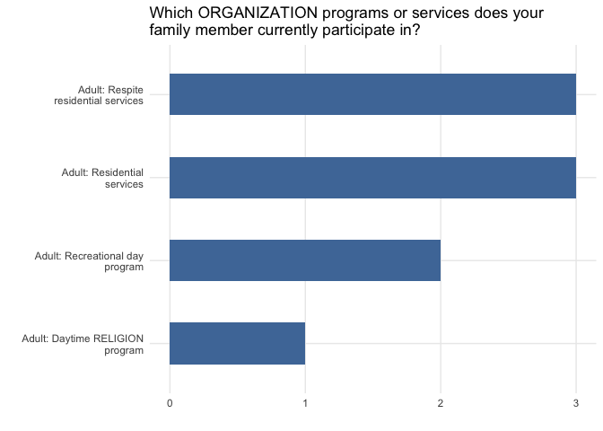<!-- -->

## 🟢 Communication and Staying Connected

### 🟢 Question 4

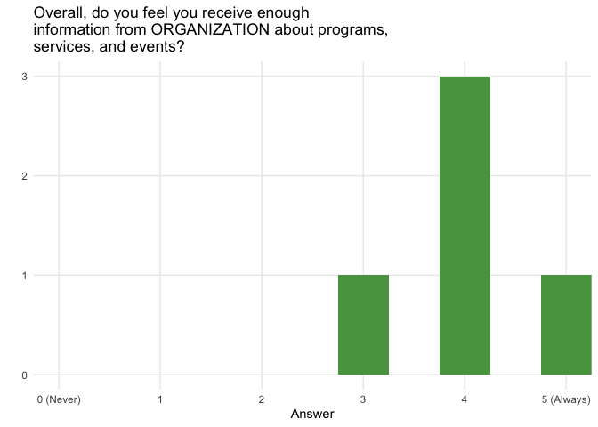<!-- -->

### 🟢 Question 5

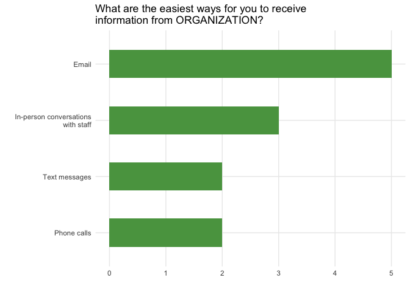<!-- -->

### 🟢 Question 6

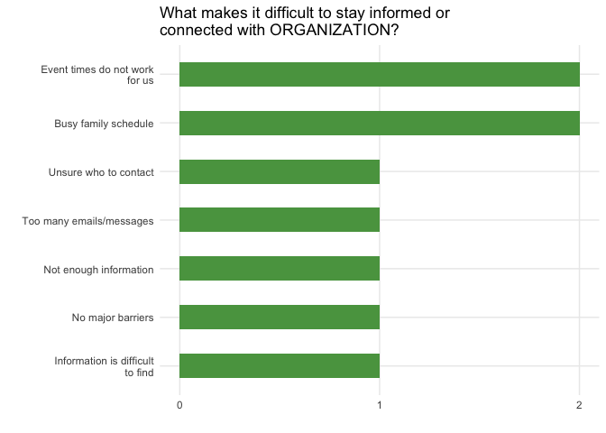<!-- -->

### 🟢 Question 7

| If you have suggestions for improving communication, please tell us more. |
|:---|
| After 5 pm during the week or on the weekends in the winter work best for us |
| When major changes take place communication should be timely. |

## 🟠 Experiences and Priorities

### 🟠 Question 8

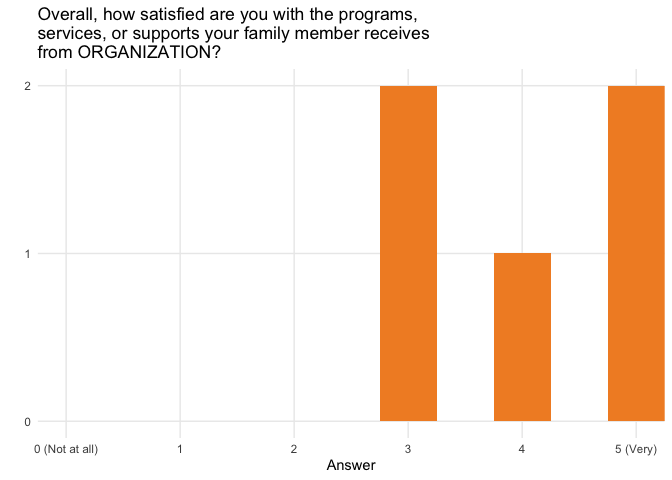<!-- -->

### 🟠 Question 9

| What does ORGANIZATION currently do well for your family member and your family? |
|:---|
| ORGANIZATION provides caring and consistent staffing for my daughter. |
| Personal care is excellent. |
| Respite |
| Socialization |
| Work together to find solutions at the senior level |

### 🟠 Question 10

| What could ORGANIZATION improve? |
|:---|
| Attention to medical needs |
| More communication with staff (personal care staff) that will be working with the individual needing care. Information is provided about the individual but occasionally the personal care stuff does not have an understanding of behaviours or strategies that work best for the individual especially if they are non verbal. |
| More options during winter (weekends) |
| Some staff would benefit from individual training on how best to work with our loved one |

### 🟠 Question 11

| Are there any services, supports, or opportunities you feel are currently missing? (eg. social opportunities, transition from youth to adult supports, respite, employment supports, family education, recreation, or community inclusion.) |
|:---|
| Families could have more social opportunities |
| Opening more respite spots for families who require support. |
| Understanding of how to access services and transition to residential services. |

### 🟠 Question 12

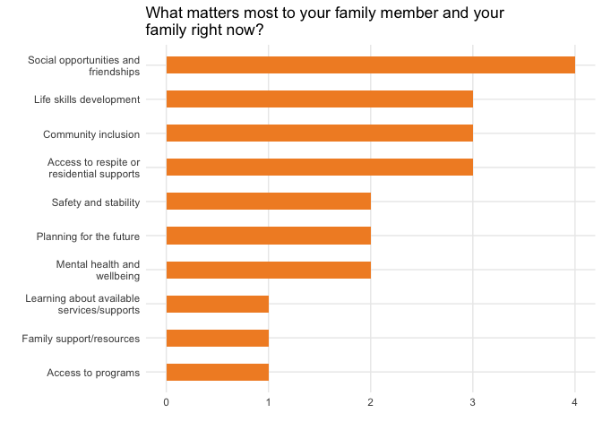<!-- -->

### 🟠 Question 13

| What are your biggest concerns about the future for your family member? |
|:---|
| Finding a residential spot for our son as we age. We would love to have him settled . DSO has no idea when someone gets off the list. It seems the system works on crisis situations . |
| Lack of placements and sustainable long term government funding |
| To be happy in a safe environment |

## 🟣 Family Engagement and Events

### 🟣 Question 14

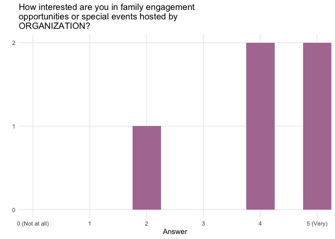<!-- -->

### 🟣 Question 15

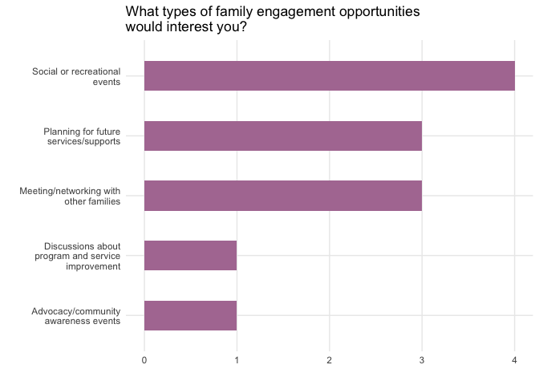<!-- -->

### 🟣 Question 16

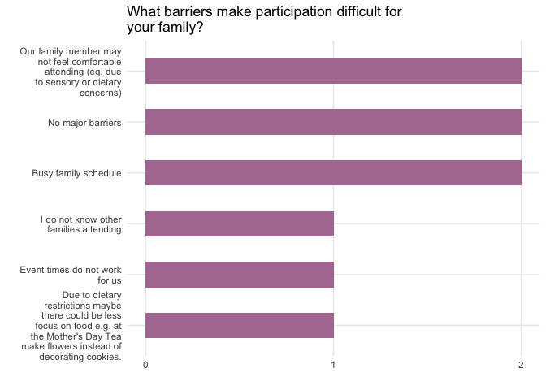<!-- -->

### 🟣 Question 17

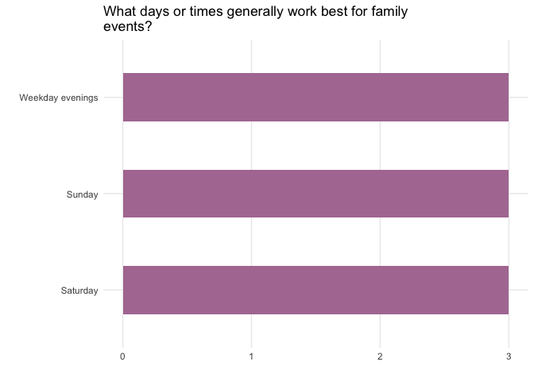<!-- -->

### 🟣 Question 18

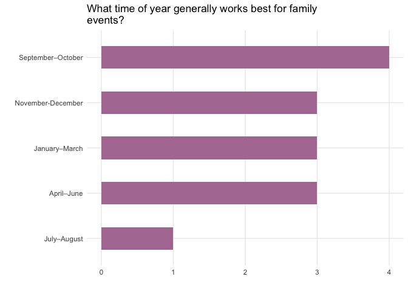<!-- -->

### 🟣 Question 19

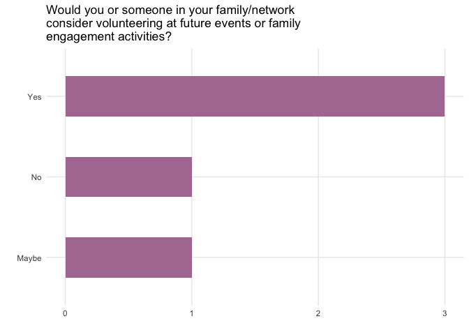<!-- -->

## 🔴 Final Thoughts

### 🔴 Question 20

| If ORGANIZATION could improve one thing over the next year, what would you prioritize? |
|:---|
| Gaining and retaining knowledge, committed staff |
| Hire an ED so staff dont burn out or go too long without a leader |
| Keeping families updated about changes to the organization |
| Open more respite support . |

### 🔴 Question 21

| Is there anything else you would like us to know? |
|:--------------------------------------------------|
| Thank you                                         |

### 🔴 Question 22

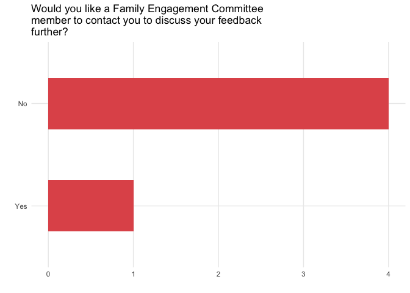<!-- -->

## Word Clouds

As there are several questions that have free-form text fields for
responses. A simpler way to view the results are with word clouds - a
graphical representation of how often words are used in the answers with
the size of the text representing frequency, after having removed
common, uninformative words such as “and”, “a”, and “if”.

### 🟢 Question 7

If you have suggestions for improving communication, please tell us
more.

<!-- -->

### 🟠 Question 10

What could ORGANIZATION improve?

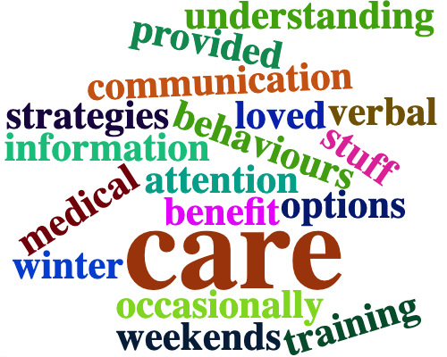<!-- -->

### 🟠 Question 11

Are there any services, supports, or opportunities you feel are
currently missing? (eg. social opportunities, transition from youth to
adult supports, respite, employment supports, family education,
recreation, or community inclusion.)

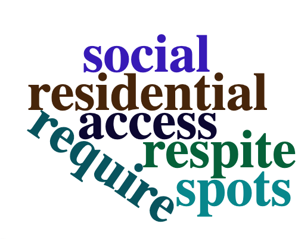<!-- -->

### 🟠 Question 13

What are your biggest concerns about the future for your family member?

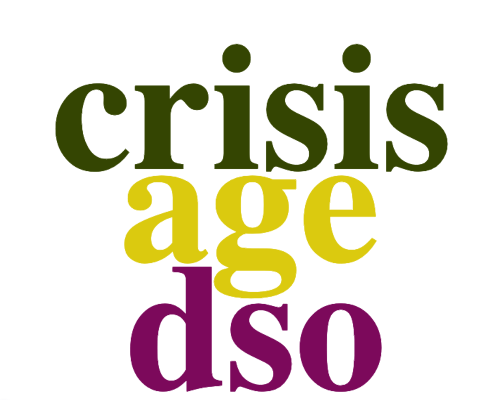<!-- -->

### 🔴 Question 20

If ORGANIZATION could improve one thing over the next year, what would
you prioritize?

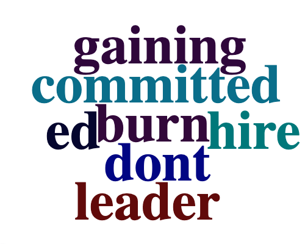<!-- -->
